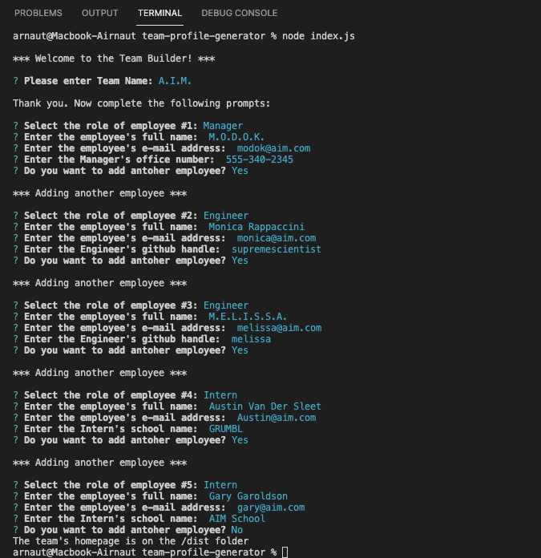
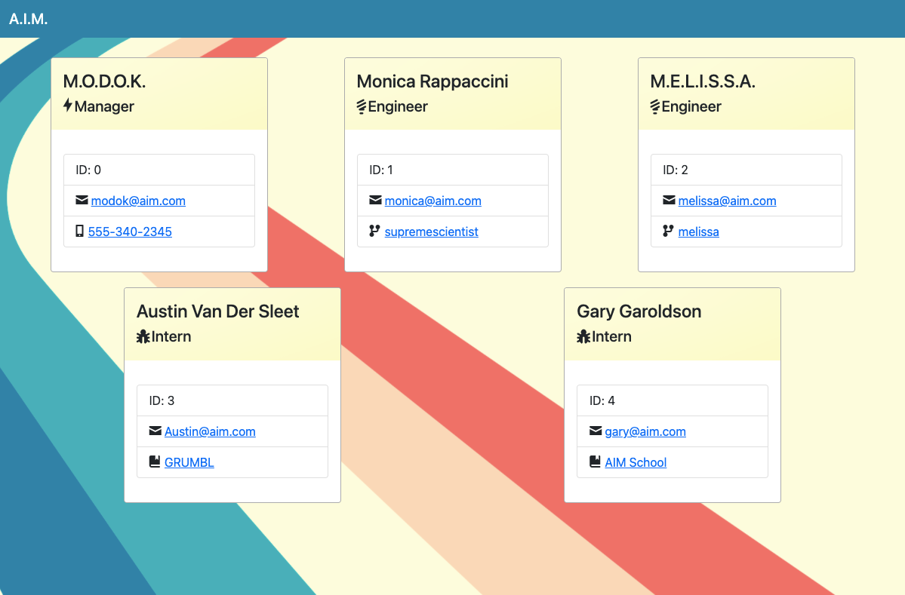
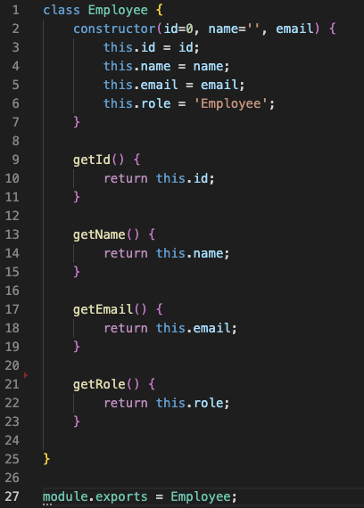
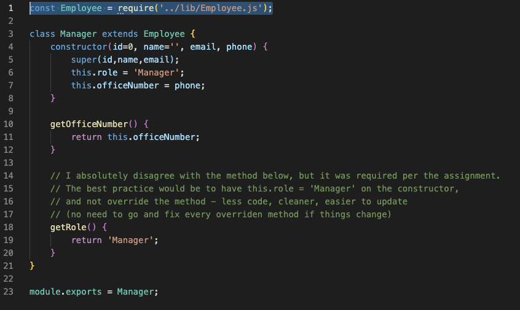
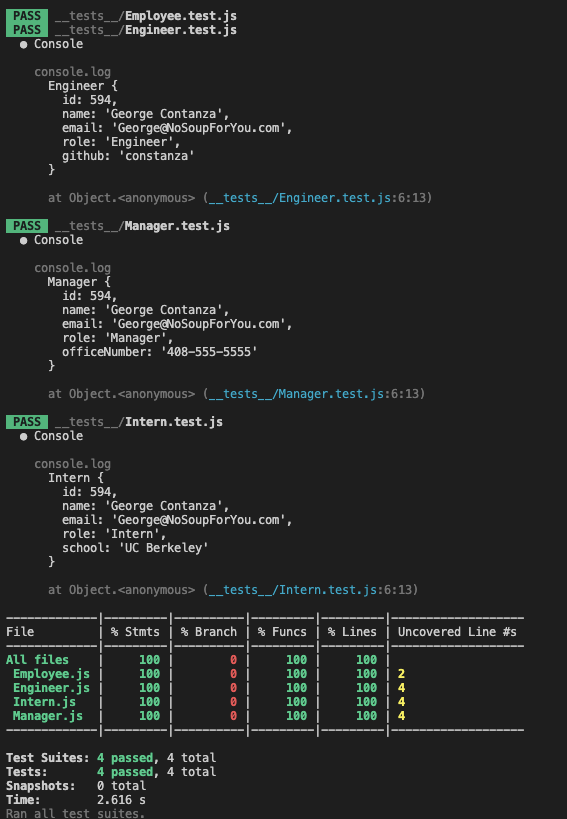

# 09 An HTML generator using Node.JS
[](https://www.gnu.org/licenses/gpl-3.0)

## Description
This is a quick Node.JS app that creates an HTML file based on user prompts. This is a command-line app asks for information about a Team and its team members. And then it renders a beautiful index.html page with the team members as cards in a responsive UI.

## Table of Contents
* [Installation](#Installation)
* [Usage](#Usage)
* [Code](#Code)
* [License](#License)
* [Test instructions](#Test-Instructions)
* [Questions](#Questions)

## Installation
This app uses [INQUIRER](https://www.npmjs.com/package/inquirer), [FS](https://nodejs.org/api/fs.html), and [PATH](https://nodejs.org/api/path.html). 

For this specific app, we'll only install the three mentioned above:

```
npm install inquirer
```

```
npm install fs
```

```
npm install path
```

Optionally, it is possibl to install all NPM modules:

```
npm install 
```

## Usage
In order to run the application, users only need to run the index.js file. This is a super short file that calls the main class: Team, which takes care of the question prompting and storing all the data in an object.

``` 
node index
```
For reference, here are the contents of index.js (extremely self-explanatory, I know...):

```
const Team = require('./lib/Team');

new Team().initializeTeam();
```

Now, the method initializeTeam from the object Team will be called. The pseudocode goes more or less like this:

* Initialize the Team: Ask for team name
* Ask for the details of an employee:
  * Ask for role
  * Ask for name
  * Ask for e-mail
  * Ask for additional details depending on role:
    * Manager: office phone number
    * Engineer: GitHub handle
    * Intern: School
* Ask the user if they want to add another employee

Keep doing this until the user says No. Click on the image below to see the app in action!

[](https://drive.google.com/file/d/1ag7LGkUOy_i2r5YIRQLQgqqFSmL7a0SN/view)

Et voilá, here's the actual final result (Click on the image to see the working result video):

[](https://drive.google.com/file/d/1BI_SBpotTHgNq_V3OG1X8vNC1FTFFZue/view)

## Code

The superclass of this app is Employee. All other employee types: Manager, Engineer, and Internal extend this class. 

Superclass Employee:


Manager class extending Employee:


## Tests

Test suites were created for all four classes. These are available on the **\__test\__** folder. Here are the test results (Click on the image to see a video of the tests running):

[](https://drive.google.com/file/d/12m7eNtoZwPxticy5__Usv_N4rvAAV3Zh/view)

Each test validates all properties and methos of each class. For example: Employee.test.js:

```
const Employee = require('../lib/Employee.js');

test('Creates a random Employee object', () => {
    const employee = new Employee(594,'George Contanza','George@NoSoupForYou.com');
    expect(employee.getId()).toEqual(expect.any(Number));
    expect(employee.getName()).toEqual(expect.any(String));
    expect(employee.getName().length).toBeGreaterThan(0);
    expect(employee.getEmail()).toEqual(expect.any(String));
    expect(employee.getEmail().length).toBeGreaterThan(0);
    expect(employee.getRole()).toEqual('Employee');
});
```

## Questions
E-mail me: <lou.arnaut@gmail.com>
Checkout my Github profile: [acevezl](https://github.com/acevezl)
